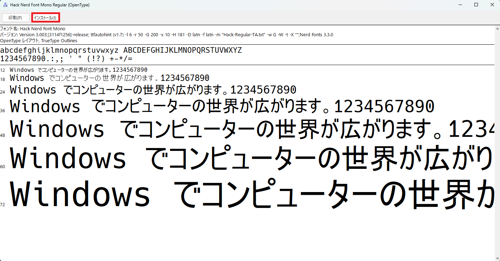
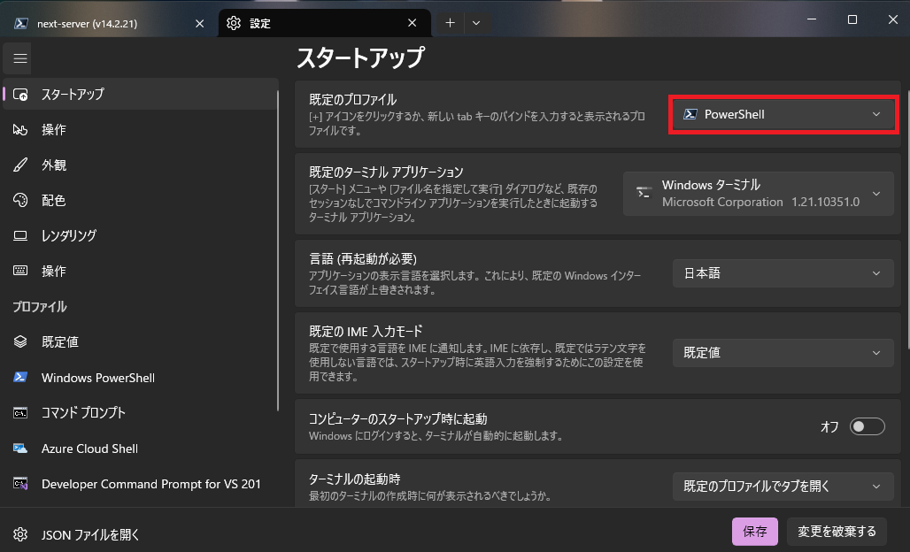
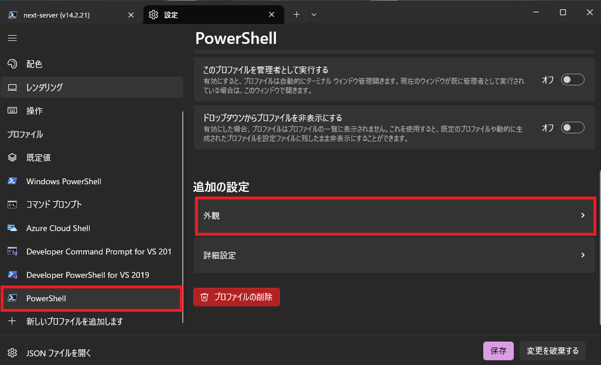
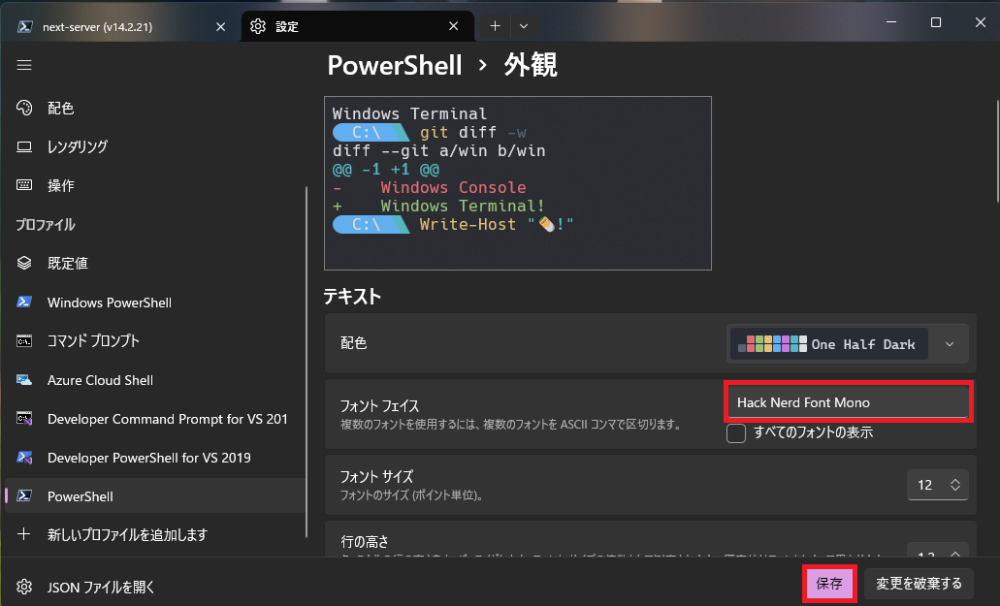
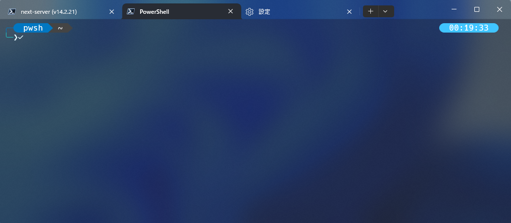
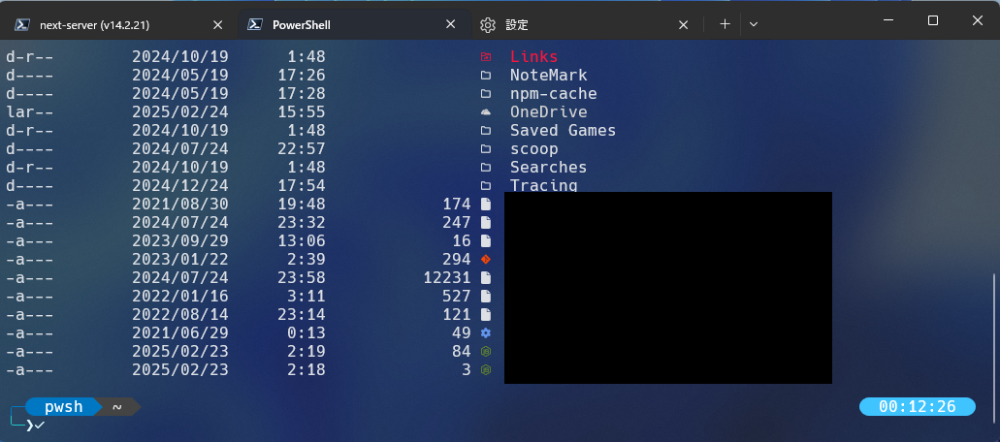

# Oh My Poshとは

Oh My Posh は、Windows、Mac、Linux で使える シェルプロンプトのカスタマイズツール です。PowerShell、Bash、Zsh、Fish などに対応しており、カラフルで見やすいプロンプトを簡単に設定できます。

# ディレクトリツリー

```
%USERPROFILE%
├── .config
│   ├── powershell
│   │   ├── user_profile.ps1
│   │   ├── user.omp.json
C:\
├── ドキュメント
│   ├── PowerShellMicrosoft.PowerShell_profile.ps1
```

# 1. Microsoft StoreでPowerShellをインストールする

1. Micsoroft Store Appを開く

2. 検索バーで`PowerShell`と入力する

3. `PowerShell`をクリックし、`入手`をクリックする

# 2. Nerd Font をインストールする

1. 以下のリポジトリから`Hack.zip`をダウンロードする  
   ::github{repo="ryanoasis/nerd-fonts"}

2. ダウンロードしたZIPファイルを展開し、`HackNerdFontMono-Regular.ttf`をダブルクリックし`インストール`をクリックする
  

# 3. Windows Terminalの設定を変更する

1. `ターミナル`を開く

2. `設定`をクリックする

3. `スタートアップ`で規定のプロファイルを先程インストールした`PowerShell`に変更する
   

4. プロファイルで`PowerShell`を選択し、下部の`外観`をクリックする
   

5. フォントフェイスを`Hack Nerd Font Mono`に変更し`保存`をクリックする
   

# 4. Oh My Poshをインストールする

1. wingetを利用してOh My Poshをインストールする

```powershell
winget install JanDeDobbeleer.OhMyPosh
```

2. `%UserProfile%\.config\powershell`に`user_profile.ps1`を作成する

3. 以下のスクリプトをコピペする

```powershell title="user_profile.ps1"
# set PowerShell to UTF-8
[console]::InputEncoding = [console]::OutputEncoding = New-Object System.Text.UTF8Encoding

# Prompt
$omp_config = Join-Path $PSScriptRoot ".\user.omp.json"
oh-my-posh --init --shell pwsh --config $omp_config | Invoke-Expression
```

4. `%UserProfile%\.config\powershell`に`user.omp.json`を作成する

5. 以下のJSONをコピペする

```json title="user.omp.json"
{
  "$schema": "https://raw.githubusercontent.com/JanDeDobbeleer/oh-my-posh/main/themes/schema.json",
  "blocks": [
    {
      "type": "prompt",
      "alignment": "left",
      "segments": [
        {
          "properties": {
            "cache_duration": "none"
          },
          "leading_diamond": "\u256d\u2500\ue0b6",
          "template": " {{ .Name }} ",
          "foreground": "#ffffff",
          "background": "#0077c2",
          "type": "shell",
          "style": "diamond"
        },
        {
          "properties": {
            "cache_duration": "none",
            "root_icon": "\uf292"
          },
          "template": "<parentBackground>\ue0b0</> \uf0e7 ",
          "foreground": "#FFFB38",
          "background": "#ef5350",
          "type": "root",
          "style": "diamond"
        },
        {
          "properties": {
            "cache_duration": "none",
            "enable_hyperlink": true,
            "style": "full"
          },
          "template": " {{ .Path }} ",
          "foreground": "#E4E4E4",
          "powerline_symbol": "\ue0b0",
          "background": "#444444",
          "type": "path",
          "style": "powerline"
        },
        {
          "properties": {
            "branch_icon": "\ue725 ",
            "cache_duration": "none",
            "fetch_status": true,
            "fetch_upstream_icon": true
          },
          "template": " {{ .HEAD }} {{ if .Working.Changed }}{{ .Working.String }}{{ end }}{{ if and (.Working.Changed) (.Staging.Changed) }} |{{ end }}{{ if .Staging.Changed }}<#ef5350> \uf046 {{ .Staging.String }}</>{{ end }} ",
          "foreground": "#011627",
          "powerline_symbol": "\ue0b0",
          "background": "#FFFB38",
          "type": "git",
          "style": "powerline",
          "background_templates": ["{{ if or (.Working.Changed) (.Staging.Changed) }}#ffeb95{{ end }}", "{{ if and (gt .Ahead 0) (gt .Behind 0) }}#c5e478{{ end }}", "{{ if gt .Ahead 0 }}#C792EA{{ end }}", "{{ if gt .Behind 0 }}#C792EA{{ end }}"]
        }
      ]
    },
    {
      "type": "prompt",
      "alignment": "right",
      "segments": [
        {
          "properties": {
            "cache_duration": "none",
            "fetch_package_manager": true,
            "npm_icon": " <#cc3a3a>\ue5fa</> ",
            "yarn_icon": " <#348cba>\uf61a</>"
          },
          "leading_diamond": " \ue0b6",
          "trailing_diamond": "\ue0b4",
          "template": "\ue718 {{ if .PackageManagerIcon }}{{ .PackageManagerIcon }} {{ end }}{{ .Full }}",
          "foreground": "#3C873A",
          "background": "#303030",
          "type": "node",
          "style": "diamond"
        },
        {
          "properties": {
            "cache_duration": "none",
            "fetch_package_manager": true,
            "npm_icon": " <#cc3a3a>\ue5fa</> ",
            "yarn_icon": " <#348cba>\uf61a</>"
          },
          "leading_diamond": " \ue0b6",
          "trailing_diamond": "\ue0b4",
          "template": "\ue235 {{ if .Error }}{{ .Error }}{{ else }}{{ if .Venv }}{{ .Venv }} {{ end }}{{ .Full }}{{ end }}",
          "foreground": "#100e23",
          "background": "#906cff",
          "type": "python",
          "style": "diamond"
        },
        {
          "properties": {
            "cache_duration": "none"
          },
          "leading_diamond": " \ue0b6",
          "trailing_diamond": "\ue0b4",
          "template": " {{ .CurrentDate | date .Format }} ",
          "foreground": "#ffffff",
          "background": "#40c4ff",
          "type": "time",
          "style": "diamond",
          "invert_powerline": true
        }
      ]
    },
    {
      "type": "prompt",
      "alignment": "left",
      "segments": [
        {
          "properties": {
            "cache_duration": "none"
          },
          "template": "\u2570\u2500",
          "foreground": "#21c7c7",
          "type": "text",
          "style": "plain"
        },
        {
          "properties": {
            "always_enabled": true,
            "cache_duration": "none"
          },
          "template": "❯ ",
          "foreground": "#e0f8ff",
          "type": "exit",
          "style": "plain",
          "foreground_templates": ["{{ if gt .Code 0 }}#ef5350{{ end }}"]
        }
      ],
      "newline": true
    }
  ],
  "version": 3
}
```

6. 以下のコマンドでPowerShellプロファイルを作成する

```powershell
new-item -type file -path $profile -force
```

7. 以下のコマンドを入力し作成したプロファイルを編集します

```powershell
notepad $PROFILE
```

8. 以下のコマンドをコピペする

```powershell
. $env:USERPROFILE\.config\powershell\user_profile.ps1
```

9. Terminalを再起動しデザインが反映されていることを確認する
   

# 5. Terminal Iconsをインストールする

Terminal Iconsをインストールすることで不足しているフォルダまたはファイルのアイコンを追加することが出来ます。

1. 以下のコマンドでTerminal Iconsをインストールする

```powershell
Install-Module -Name Terminal-Icons -Repository PSGallery
```

2. `user_profile.ps1`を編集する

3. 以下のコマンドを追記する

```powershell title="user_profile.ps1" ins={8-9}
# set PowerShell to UTF-8
[console]::InputEncoding = [console]::OutputEncoding = New-Object System.Text.UTF8Encoding

# Prompt
$omp_config = Join-Path $PSScriptRoot ".\user.omp.json"
oh-my-posh --init --shell pwsh --config $omp_config | Invoke-Expression

# Terminal Icons
Import-Module -Name Terminal-Icons
```

4. Terminalを再起動し、`ls`コマンドを入力後、アイコンが適用されていることを確認する
   

# 参考にさせていただいたサイト・動画

<iframe width="100%" height="468" src="https://www.youtube.com/embed/5-aK2_WwrmM?si=8K7wIFxGbdiYxkZx" title="YouTube video player" frameborder="0" allowfullscreen class="mb-2"></iframe>

https://learn.microsoft.com/ja-jp/windows/terminal/tutorials/custom-prompt-setup#customize-your-powershell-prompt-with-oh-my-posh
